# Hypermuse

**Be seen on the dark side of the moon.**

HyperMuse is an audio-reactive holographic fan: a spinning LED arm on a 4.3 m tower,
rigged above a DJ booth or standing on its own, on which black is not black but
transparent — so the picture hangs in the air with the room visible straight through it.
It debuted at Burning Man PlayAlchemist in 2023.

This repository is the software that drives it: a browser-based show built with Three.js
that turns audio energy into animated 3D geometry around a sphere, and that will just as
happily play any VJ loop or 3D visual supplied as mp4. It runs on projectors and plain
screens too — the fan is the flagship, not the only output.

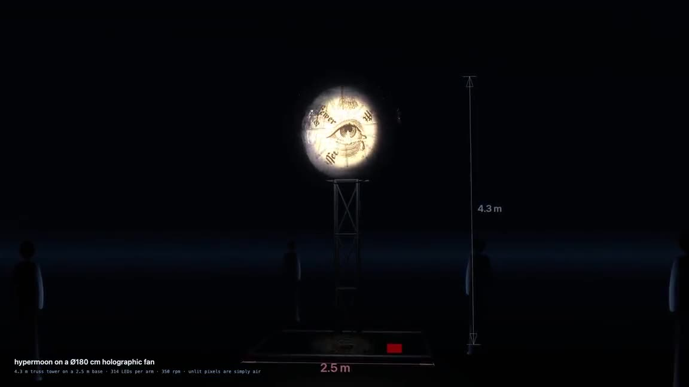

**Booking it: [specifications, requirements and cost &rarr;](#booking-the-installation)**

## What it looks like

Every frame here was rendered from the pages in this repository — none of it is mockup.
Moving versions, at a size a browser will stream, are in the
**[press kit &rarr;](https://fractastical.github.io/hypermuse/docs/press/)**, committed
under [`docs/press/`](docs/press/) so it works from a clone as well as from the web. If
you are putting promotional material together, start there: every clip has a download
link and a line saying what it is.

| The rig, 4.3 m of it | The moon, an effect a revolution | The poem, three words a side |
|:--:|:--:|:--:|
| 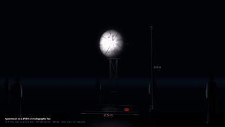 | 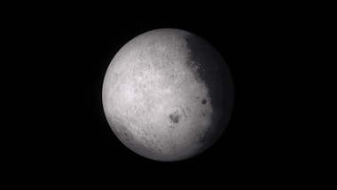 | 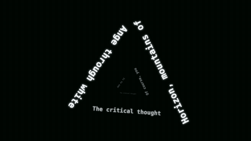 |

### Stills

| | | |
|:--:|:--:|:--:|
| 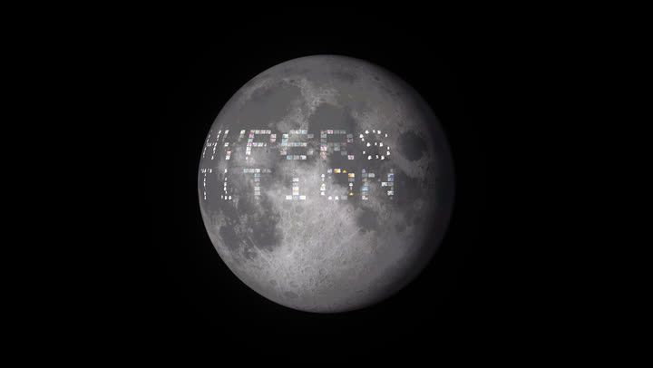<br>**The word on the dark side**<br><sub>letter cubes cut from moon footage, pinned to the shadowed terrain</sub> | 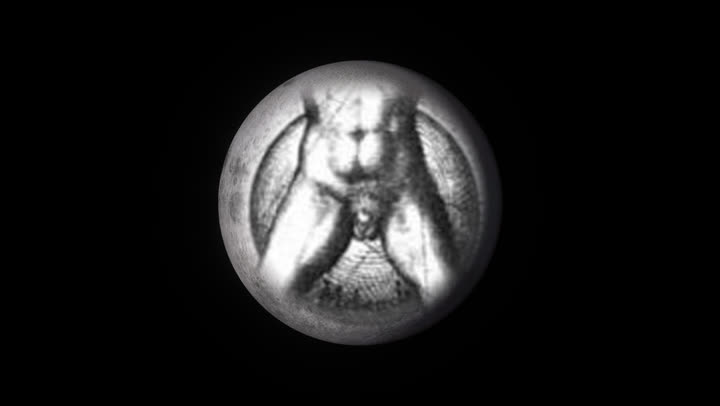<br>**Eye seal iris reveal**<br><sub>the disc opens to a clear hole onto the seal turning behind it</sub> | 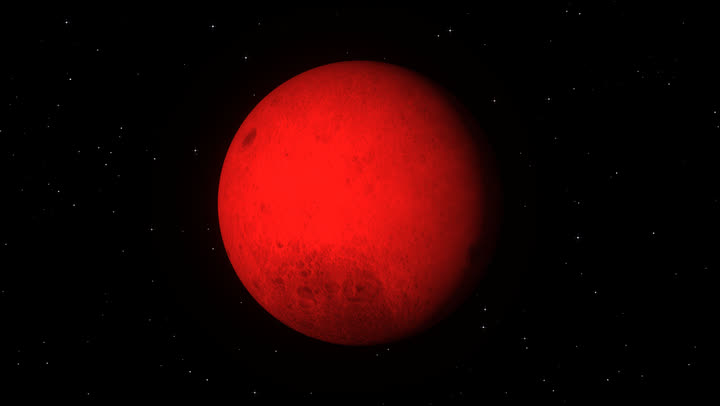<br>**Blood moon**<br><sub>a luminance-preserving grade, fadeable over a two-hour set</sub> |
| 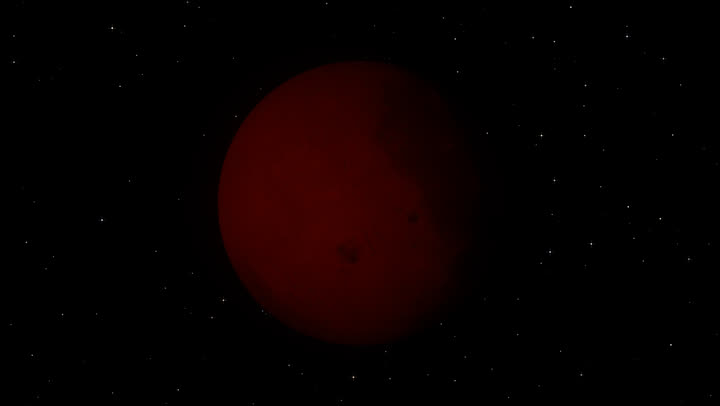<br>**Earth's shadow**<br><sub>the umbra crosses the disc, totality lit by refracted sunlight</sub> | 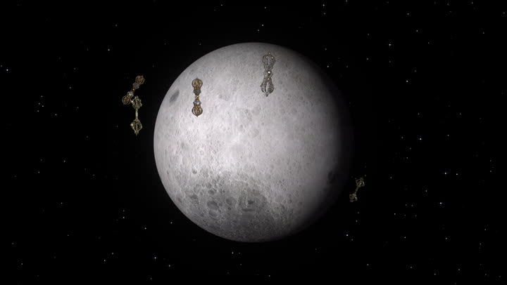<br>**Orbiting vajras**<br><sub>dorje sprites on tilted lanes that pass behind the disc</sub> | 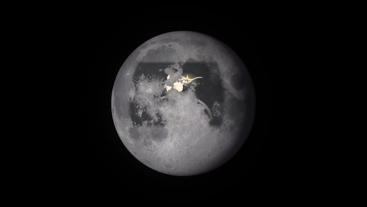<br>**The star fisher**<br><sub>hooks a star, cups it, lets it go — the freed stars make a heart</sub> |
| 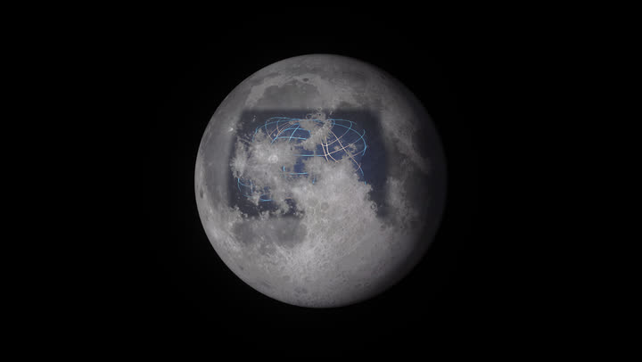<br>**Sonic sphere**<br><sub>the real normal modes of a vibrating sphere, driven by the room</sub> | 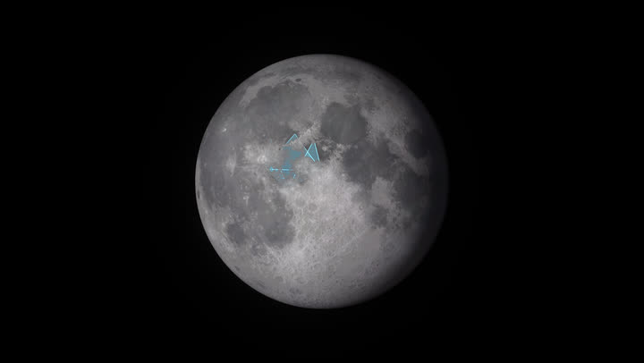<br>**Synergetics fold**<br><sub>Fuller 100.41 — a triangle folding itself into a tetrahedron</sub> | 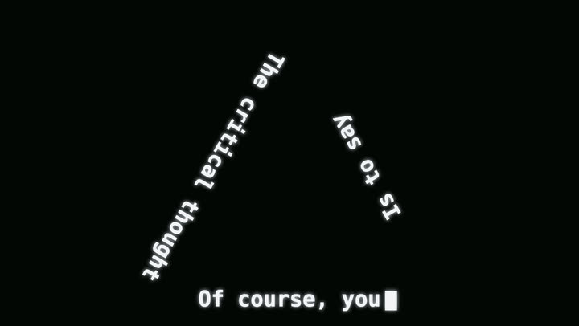<br>**The poem screen**<br><sub>nine words a screen, a line to each side of the triangle</sub> |
| 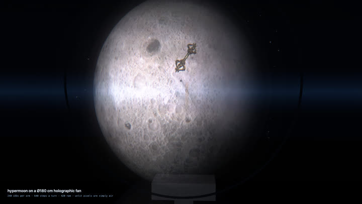<br>**The fan up close**<br><sub>persistence of vision, sampled the way the blade sweeps it</sub> | 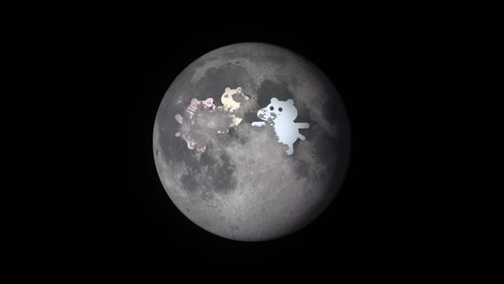<br>**Dancing mumins**<br><sub>a troupe of little trolls dancing across the shadowed terrain</sub> | |

### Where the assets are

| | |
|---|---|
| [`docs/gallery/`](docs/gallery/) | the stills above, 720 px wide, ~15 KB each |
| [`docs/press/clips/`](docs/press/clips/) | twelve clips, 5 s to the full poem, ~1 MB each bar the poem, no audio |
| [`docs/press/loops/`](docs/press/loops/) | GIFs, including the three above, for pasting into a page that will not play video |
| [`docs/press/posters/`](docs/press/posters/) | a frame from the middle of each clip, for thumbnails |
| [`docs/press/contact-sheet.jpg`](docs/press/contact-sheet.jpg) | every still on one image, which is what a promoter asks for first |
| [`docs/press/hypermuse-one-pager.pdf`](docs/press/hypermuse-one-pager.pdf) | the booking sheet — specs, requirements, cost, contact |
| `artifacts/` | the full-resolution masters — gitignored, so rebuild them locally |

Everything in `docs/` is generated and can be rebuilt: `npm run gallery` reshoots the
stills, `npm run press` re-cuts the clips and the page from whatever masters are in
`artifacts/`, and the masters themselves come from `npm run demo:projectors`,
`npm run export:reel`, `npm run export:art`, `npm run export:film` and
`npm run export:holofan`.

## Booking the installation

The page to send someone is **[fractastical.github.io/hypermuse &rarr;](https://fractastical.github.io/hypermuse/)**,
which is this section with the pictures moving and a button that opens WhatsApp. It is
generated by `npm run press` and written twice, to the repository root and to `docs/`,
because Pages builds this repo from its root: without the root copy the short URL renders
this README in Jekyll's stock white theme instead.

HyperMuse can be hired as a single-day install. What arrives is the fan, a box-truss tower
and its ground frame; what it needs from the venue is a ladder, a laptop with an HDMI port,
and somewhere 2.5 m square to stand. The tower is built from truss sections, so 4.3 m is
the usual height rather than a fixed one — it can come down for a low ceiling or go up over
a taller booth.

| | |
|---|---|
| Height | 4.3 m to the top of the disc, adjustable |
| Footprint | 2.5 m square ground frame |
| Install | 2 people, 2.5 hours |
| Breakdown | 2 people, 1 hour |
| Needs | a ladder, and a laptop with an HDMI port |
| Cost | negotiable — 750 EUR is the usual single-day install |
| Debut | Burning Man PlayAlchemist, 2023 |

It ships with an equalizer that can be preconfigured for the night's music, and it will
play VJ loops or 3D visuals supplied as mp4 — or run this show, live and reacting to the
room. The render above is that rig, dimensioned: `SHOT=rig npm run export:holofan` builds
it, and `holofan.html?shot=rig` is it in a browser.

### If you are the one playing

Four things a DJ tends to ask before anything about the art, all of them features in
this repository rather than promises:

- **Your mark goes on it.** A guest logo sits on the moon's shadowed side the same way
  the hyperstition word does — either as clean artwork, or rebuilt out of moon footage
  so it reads as terrain. `npm run preview:logo -- your-mark.png` shoots it at full size
  beforehand, so nobody finds out on stage that a wordmark shreds.

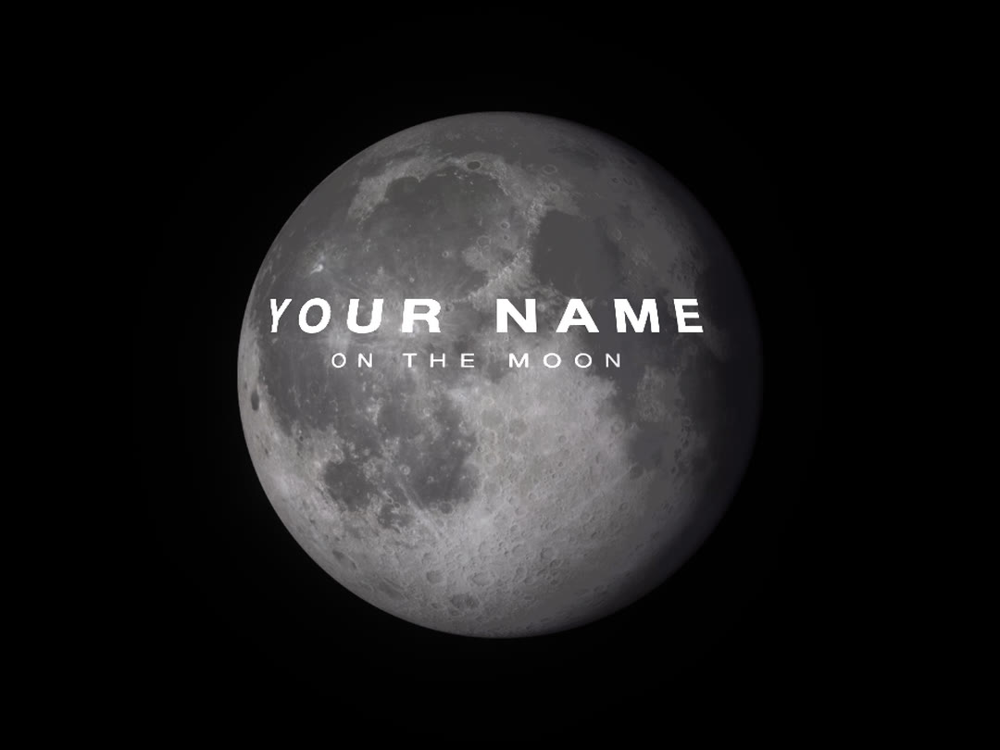

- **It listens to the room, not to our laptop.** The machine driving the fan opens its
  own microphone (`hypermoon.html?mic=1`), so the geometry answers whatever the PA is
  doing. Bass swells the sphere, beats flare the orbits, loud passages shake the
  lettering. Nothing is routed through us and nothing needs timecode.
- **It runs the set without a VJ.** `?program=hour` is an hour of scheduled acts —
  a different effect each revolution — that loops for as long as the night does, and the
  speed control stretches it, so half speed is a two-hour arc. It takes direction live
  if you want it and needs nobody if you don't.
- **The fan is not the only output.** The same show drives projection (402 × 226 cm is
  its native shape, two surfaces if you have them) and LED walls, at 1920 × 1080 for a
  bar screen or 1872 × 1296 for a DJ screen.

The booking sheet as sent is [`docs/press/hypermuse-one-pager.pdf`](docs/press/hypermuse-one-pager.pdf).
It quotes one height and one price; the table above is the current answer where the two differ.

**Joel Dietz** · [@fractastical](https://t.me/fractastical) on Telegram ·
[+1 (628) 333-1011](https://wa.me/16283331011) on WhatsApp

[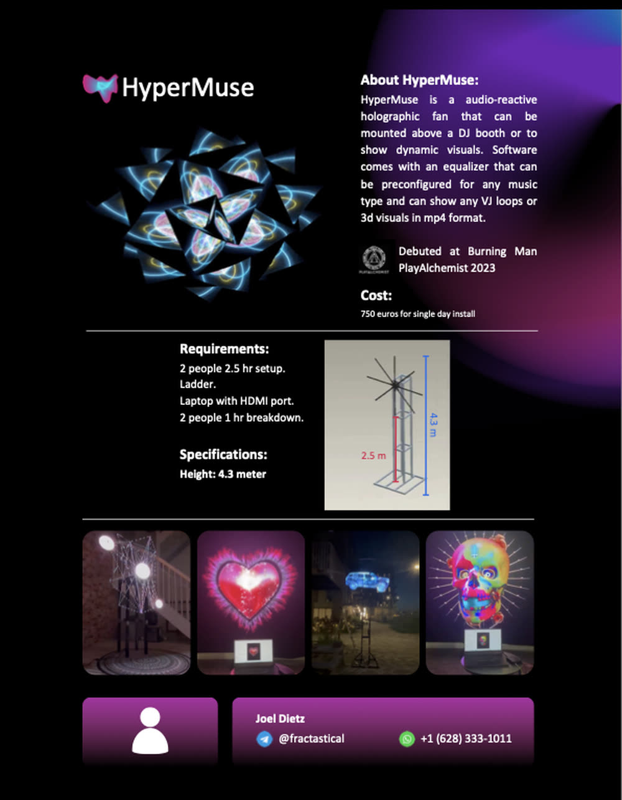](docs/press/hypermuse-one-pager.pdf)

> **Just want to run the show, not read code?** Jump to
> [Using Hypermuse (plain-language guide)](#using-hypermuse-plain-language-guide).
> An illustrated PDF covering every mode lives at `artifacts/hypermuse-modes-guide.pdf`
> (regenerate with `npm run guide:pdf`; refresh its screenshots with `npm run guide:stills`).

## Using Hypermuse (plain-language guide)

This section is for performing with Hypermuse without touching any code. If someone
technical set it up for you, you can ignore everything else in this README and just
follow along here.

### The big picture: two windows

Hypermuse runs as **two windows**:

- **The controller** (`controller.html`) — your "remote control." This is where you
  click buttons. The audience never sees this.
- **The visual** (`sonicsphere.html`) — the actual art that reacts to music. This is
  what you put on the big screen / projector.

The controller opens the visual for you and sends it commands. Think of it like a
lighting desk (controller) driving a stage (visual).

The **Controller style** dropdown (top row) recolors the control panel itself —
`crt green` (phosphor + scanlines, matches the Ikegami terminals), `green mono`
(flat terminal), `amber terminal`, or `red alert`. It only themes this window,
never the outputs, and the choice persists across reloads.

### Step 1: Start it up

If the app is already running on the computer, open a web browser (Chrome works best)
and go to:

```
http://localhost:8080/controller.html
```

If nothing loads, someone needs to start the app once. A technical helper can do this
by opening a terminal in the project folder and running `npm install` (first time only)
then `npm start`. After that, the link above will work.

### Step 2: Open the visual

On the controller, click **`open/reopen visual`** (top of the page). A second window
opens — that's your art. Drag it onto your projector/second screen and make it
fullscreen.

> Tip: the easiest way to start with something good-looking is to click one of the
> **Presets** buttons (for example `cells1+cells2 autoplay (with logo)`). It opens the
> visual already configured.

### Step 3: Play music

The visuals react to sound. You have two options:

- **Easiest:** just play music out loud / through the venue — but the visual needs the
  audio fed into it. For a reliable signal, load an audio file directly: in the visual
  window there's a **`Music`** file picker — choose an `.mp3`/`.wav` and it starts
  reacting.
- Press **`h`** in the visual window to hide or show its control panel.

### Step 4: Drive the look from the controller

Here's what each section of the controller does, in plain terms:

- **FX Mode** — the overall "style" of the visuals. Click one anytime to switch:
  - `classic` — the original glowing geometric shapes and lines
  - `life` — cells being born and dying (classic "game of life" feel)
  - `hier life` — layered living patterns
  - `hex life` — honeycomb cellular patterns that sweep down the screen
  - `kuramoto` — pulsing waves that fall in and out of sync
  - `gray-scott` — organic, blobby coral/spot patterns
  - `physarum` — slime-mold-like flowing trails
  - `molecule` — rotating 3D molecule structures
  - `next mode` — just jump to the next style
- **Hex CA** — fine-tunes the honeycomb "hex life" style:
  - `speed` — how fast the pattern evolves (1.0 is normal)
  - `sync audio` — when checked, the pattern speeds up/down with the music
  - `rule` — the "recipe" for the pattern (try `bloom`, `maze`, `coral` for different
    looks)
  - `cycle rule` — flips to the next recipe automatically
  - `aperiodic` — adds non-repeating randomness (0 = clean, higher = more chaotic)
  - `palette` — the color scheme (`aurora`, `magma`, `violet`, `mono`, `neon`)
  - `apply hex` — switches to hex mode and applies your settings
- **Basic Video Mode** — show your loaded video clips fullscreen with little/no effects.
  Good for a clean break.
- **Bridge** — `fade to black` and `fade in`. Your safety buttons for transitions.
- **SynBioBeta Logo** — show/hide a logo overlay and set its position/opacity.
- **Triangle (mosaic) vids** — tiles video clips into a mosaic; `triangle + fx` adds
  effects on top.
- **Loop Rating** — `like loop` keeps a clip around; `dislike & skip` drops it and moves
  on. Use this to curate what plays during the show.
- **Folder loops (playlist)** — tick/untick which folders of clips are allowed to play.
- **Color board / Color cube board** — filter or display clips by color family.

### The other output: the hypermoon

The sphere is not the only thing the controller can drive. **Hypermoon**
(`hypermoon.html`) is a photographic moon that turns in space, with a window
onto its dark side that content shows through — a word spelled out in astronaut
photographs, a terminal typing, Buckminster Fuller's shapes folding, orbiting
vajras, an eclipse. The controller has its own Hypermoon panel: click
**`open output`** there instead of `open/reopen visual`, and drive it with the
**word**, **window content**, and **window size** controls, all of which apply
live without reloading.

It is the right output for a single striking image — a holographic fan, a
projector on a dome, a CRT — where the sphere is the right output for a busy
club screen. Everything it can do is in
[Hypermoon output & kiosk mode](#hypermoon-output--kiosk-mode) below, and the
illustrated PDF walks through every mode with pictures.

### A typical live flow

1. Click a **Preset** to open the visual, then make it fullscreen on the projector.
2. Start your **music** (load an audio file in the visual window).
3. Pick an **FX Mode** that fits the song (e.g. `hex life` for builds,
   `gray-scott` for ambient moments).
4. For hex mode, leave **`sync audio`** on so it moves with the beat; tweak `palette`
   to match the mood.
5. Use **`next mode`** or click another FX button to change the vibe between sections.
6. Use **`fade to black`** / **`fade in`** for clean transitions.
7. `like` / `dislike & skip` clips as they play to shape the set.

That's the whole job — pick a mode, match the palette to the music, and use fades for
transitions. Everything below is for people who want to build sets, export videos, or
modify the code.

## What the project does

- Analyzes incoming audio with the Web Audio API (`AnalyserNode`).
- Splits the frequency spectrum into bands and tracks per-band energy.
- Maps those bands to points distributed on a sphere.
- Creates reactive shapes, lines, and polygons when band thresholds are exceeded.
- Optionally textures geometry with video frames for VJ-style visuals.
- Exposes many live controls (thresholds, hue, camera/light, rotation, density)
  through a controller window.

## How it is structured

The app is mostly multi-page HTML + inline script, with shared helpers in `js/`.

- `controller.html` -> opens an output page in a second window and drives it, with
  `postMessage` for the spheres and a `BroadcastChannel` for the hypermoon.
- `sonicsphere.html` -> main audio-reactive sphere renderer.
- `hypermoon.html` -> the rotating moon with a window onto its dark side; the other
  main output, documented at length under
  [Hypermoon output & kiosk mode](#hypermoon-output--kiosk-mode).
- `crt-terminal.html` -> the terminal page for real broadcast CRTs, and window
  content inside the moon.
- `holofan.html` -> plays a square clip through a simulated spinning-LED holographic
  fan, for previewing that hardware.
- `stream-broadcast.html` + `stream-view.html` -> WebRTC sender and viewer for
  watching an output live on another device.
- `hyperstition-moon.html` -> the earlier word-on-the-moon page: a 2D canvas mosaic
  spelling a word out of moon-colored cube tiles from `artifacts/moon-cube-index.json`.
- `hyperstition-moon-halo.html` -> the same lettering orbiting a moon video on a
  tilted 3D ellipse, with optional vajra clips. Both export via
  `npm run export:hyperstition:moon`, `npm run export:hyperstition:moon:halo`, and
  `npm run export:hyperstition:moon:vajra` (the last adds three orbiting vajras).
- `colorsphere.html` + `colorcontroller.html` -> color-focused variant.
- `poetsphere.html` + `poetcontroller.html` -> the old poetry variant: an
  audio-reactive sphere with the poem typed onto a texture. Predates hypermoon,
  talks over `postMessage` rather than the `hypermoon` channel, and its "active
  poem" box is not wired to anything. Kept for reference. For a poem in a show,
  use the poem screen below instead.
- `polysphere.html`, `videosphere.html`, `venus.html`, `kurasphere.html` ->
  alternate visualizer experiments, kept for reference rather than actively
  maintained.
- `hypersphere.html` and `kurosphere.html` are **empty placeholder files** that are
  nonetheless tracked in git. `kuramotocontroller.html` opens `kurosphere.html`, so
  that controller cannot currently work — treat all three as dead unless someone
  fills the stubs in.
- `synergetics-fold.html` -> Fuller's Synergetics 100.41 fold: a wireframe triangle
  folds its three corners up into a tetrahedron, tumbles, unfolds, and cycles
  through shape presets (`?shape=equilateral|scalene|right|cycle`, `?speed=`,
  `?color=`, `?spin=`; space pauses, `s` skips to the next shape). Export with
  `npm run export:fold`. Add `?mode=associate` for the Synergetics 108.01-03
  demonstration: two open triangular spirals (positive + negative helix,
  `?color2=` for the second strand) tremble apart as unstable separate actions,
  then associate into the tetrahedron's six edges. The two tinted "event" faces
  bloom first; the two white complementary faces converge in from outside
  ("from the rest of the Universe") and a pulse marks the enclosed center —
  inside vs outside, 1 + 1 = 4. Export with `npm run export:fold:associate`.
- `prototypes/` -> older or experimental variants.

Shared utility scripts:

- `js/video_processor.js` -> video queueing, frame capture, texture updates.
- `js/message_controller.js` -> message handling for live parameter changes.
- `js/audio_controller.js` -> audio queue playback helpers and MIDI playback logic.
- `js/sonic_geometries.js` -> reusable geometry-building utilities.
- `js/note_analyzer.js` -> note/frequency mapping and peak detection helpers.

Layered simulation scaffold:

- `js/layers/audio_engine.js` -> emits normalized audio frames (`low`, `mid`, `high`,
  `beat`, `barPhase`) from analyser data.
- `js/layers/sim_compositor.js` -> combines one or more simulation plugins into a
  texture layer for Three.js materials.
- `js/simulations/life_sim.js` -> Conway-style cellular plugin with audio-reactive
  speed/rules and beat-triggered spawning.
- `js/simulations/hierarchical_life_sim.js` -> multi-layer Life variant with coupled
  low/mid/high lanes.
- `js/simulations/hex_life_sim.js` -> hexagonal cellular automata with selectable
  `B/S` rules, color palettes, top-to-bottom reveal sweep, music sync, and an
  aperiodic modulation option.
- `js/simulations/kuramoto_sim.js` -> coupled-oscillator "communication" plugin
  (Kuramoto-inspired local neighbor sync).
- `js/simulations/gray_scott_sim.js` -> Gray-Scott reaction-diffusion plugin
  (organic coral/spot patterns with presets).
- `js/simulations/physarum_sim.js` -> Physarum (slime-mold) agent-trail plugin.
- `js/simulations/molecule_graph_sim.js` -> molecule communication graph plugin
  (SDF atom/bond topology with audio-driven diffusion + PubChem fetch support).

## External projects (`external/`)

Four upstream repos sit beside the code as plain clones. `external/` is
gitignored and they are **not** submodules, so a fresh clone of Hypermuse will
not have them — fetch whichever you need:

```bash
mkdir -p external && cd external
git clone https://github.com/kajukabla/3d-life-sim.git   # WebGPU 3D life sim
git clone https://github.com/betsee/betse.git            # bioelectric tissue sim
git clone https://github.com/fractastical/metajargon.git
git clone https://github.com/fractastical/morpholib.git
```

| project | what it is | how Hypermuse uses it |
| --- | --- | --- |
| `3d-life-sim` | WebGPU 3D Game of Life (MIT, Node 22+, pnpm + Vite) | built to static files and served alongside the other pages |
| `betse` | bioelectric tissue simulator | `npm run build:betse:loops` turns its output into VJ loops (`BETSE_ROOT=` overrides the path) |
| `metajargon` | molecule/SDF tooling | its `parseSDF` approach is adapted by the molecule-graph plugin |
| `morpholib` | morphological animation library | reference for the Morpholib-style cellular systems in the layered sim |

`3d-life-sim` needs a build before it can be served, and a WebGPU-capable
browser to run:

```bash
cd external/3d-life-sim
npx pnpm@10 install
npx pnpm@10 exec vite build --base=./
```

Then reach it at `http://localhost:8080/external/3d-life-sim/dist/` off the
normal `npm start` server. The `--base=./` matters: without it the build emits
absolute asset paths and the page comes up blank when served from a subfolder.

## Run locally

Because browsers restrict file/media APIs on `file://`, run a local server.

### Option 1: npm scripts

```bash
npm install
npm start
```

Then open:

- `http://localhost:8080/controller.html` (main controller -> opens visualizer)
- or `http://localhost:8080/colorcontroller.html`
- or `http://localhost:8080/poetcontroller.html`

### Hypermoon output & kiosk mode

The controller's Hypermoon panel opens `hypermoon.html` with `?kiosk=1`: drag the
window to the target display and the first click/keypress makes it fullscreen and
hides the cursor. For a true kiosk (its own Chrome instance, fullscreen from the
start, autoplay allowed with no click needed):

```bash
npm start                 # serve on :8080 (if not already running)
npm run kiosk:hypermoon   # Chrome kiosk pointed at hypermoon.html
```

### Poem screen (second projector)

The controller's **Poem screen** panel opens `crt-terminal.html` loaded with a
poem, for a second surface standing beside the moon. Put it on the second output
and leave the moon on the first; the two windows talk over the same `hypermoon`
BroadcastChannel, so there is no network in the path and nothing to fall out of
sync. Two projectors fed by one dual-output machine is the arrangement to ask
for — two machines forces the WebRTC path and puts a latency difference between
your screens.

On a projection the type size is the whole game, and it is not a free choice:
the terminal fits its type so that the tallest and widest screen in the script
still fits, so **how many lines you show at once decides how far back it reads.**
On a 226 cm high surface:

| layout | capitals | reads to |
|---|---|---|
| whole stanza (9 lines) | 7.4 cm | 11 m |
| 3 lines | 15.5 cm | 23 m |
| 3 lines, `fit=0.97` | 18.8 cm | 28 m |
| triangle, turning to the live line | 10.5 cm | 16 m |
| triangle, free spin | 7.9 cm | 12 m |

`fit` is the quantile the width is fitted to. `trinitypoem.txt` has a median
line of 16 characters and a longest of 28, so fitting the longest costs every
other line a third of its size for the sake of two lines out of 243. At `0.97`
those two are horizontally condensed a few percent and everything else grows.

Measure it for your own room and poem with:

```bash
npm run probe:poem            # H_CM=226 by default; capitals and reading distance
npm run preview:poem          # stills of the moon/poem pairing at true 16:9
npm run test:poem             # the panel drives the window, old uses unbroken
```

Three lines at a time takes `trinitypoem.txt` (27 stanzas, 243 lines) to 82
screens, about **12m 27s** at 13 characters a second with a 1.6s hold and a
1.2s turn after each line — so it sits inside the moon's hour with room to
spare, or loops five times across it. The whole pass as a file is
`npm run export:poem`.

### Pace, from the keyboard and from the room

The poem window answers the keyboard directly (with `?live=1`, which is what the
panel's open button sets), so the machine driving the projector does not have to
have the controller in front. The same keys work in the controller's poem panel.
Hold shift for a bigger step.

| key | |
|---|---|
| `→` `←` | a word on / a word back |
| `space` | pause |
| `home` | restart |
| `r` `t` | type slower / faster |
| `1`–`9` | speed straight off, from 4 to 40 cps |
| `-` `=` | hold shorter / longer |
| `0` | pace back to its defaults |
| `pgdn` `pgup` | a whole screen on / back |
| `b` | tap the beat; `shift+b` drops the lock |
| `,` `.` | fewer / more beats a screen |

**The arrows are on words, not screens.** Pause with `space` and the poem stops
writing itself; `→` then puts down the next word and `←` takes one back, rolling
into the next or previous screen at either end. That is how you walk it along
with someone reading aloud, and it composes with everything else — nudge a word
ahead of a running poem to catch up with a line, and it carries on from there.
Whole screens are on `pgdn`/`pgup`, which is also what a presenter's clicker
sends, so a clicker steps stanzas without any configuring.

**Tap `t` along to the music** and the poem stops running on a stopwatch: every
screen is then given a whole number of beats, however long its own lines are.
The hold absorbs the difference, and the typing is only hurried past your chosen
speed when the words would not otherwise be down in time — so the pacing you set
is a floor, never a target. `?beat=0.5&beats=8` sets it without tapping; `beat=0`
is free running, which is the default.

This matters because screens are not the same length. Free running, a screen
takes `chars/cps + hold` seconds, so a long stanza drifts a second or more past
a short one and the poem slides out of time with anything else in the room.
Locked, they all take `beat × beats` exactly.

The terminal's older jobs are untouched: with no new parameters it still loads
the carrier/oath script, left aligned in green with the phosphor effects on,
which is what `content=crt` inside the moon's window and `npm run export:crt`
rely on. Poem cues are opt-in behind `?live=1`, so the copy embedded in the moon
ignores them.

### Three words to a side

`?layout=triangle` sets each screen around an equilateral triangle, one line per
side. The poem is three words to the line and nine lines to the stanza, so a
screen of three lines is nine words — three to a side — and `group=3` and the
triangle are the same division of the same thing. Each baseline sits on its own
side with the letters growing inward.

The catch with a fixed triangle is that only one of its three sides reads
normally; the other two arrive at an angle. So by default the triangle **turns a
third of a turn every time a new line starts**, which puts the line being
written along the bottom, upright and left to right, every time. Finished lines
ride up the other two sides, the shape has gone round once by the end of each
screen, and it keeps going the same way for the whole poem rather than unwinding
between screens.

This costs nothing in type size. An equilateral triangle fills exactly the same
box whichever of its three faces is down, so the resting size is the size a fixed
triangle gets; it only needs more room during the turn itself, and it draws in
about 13% for the time that takes. Turn it off with `?trifollow=0`.

It does cost time. **Nothing is written while it turns** — otherwise the opening
characters of every line go down while the side they belong to is still swinging
into place, which is the one thing the turn exists to prevent, and the slower and
more legible you make the turn the more of the line it spoils. So `?triease=1.2`
is time added to each line rather than overlapped with it: a three-line screen
costs 3.6 s more than it used to. Take the same off the hold (`?hold=1.6` in
place of 2.2, or the slider in the panel) to get the old length back. Under a
beat lock this is handled for you — the typing is hurried enough to fit both the
words and the turns into the bar.

The turn is a smoothstep, not a cubic ease. A cubic in-out looks gentle written
down and is not: it sits still at both ends and pays for that by running three
times its own average speed through the middle, which on a whole triangle of
words reads as a whip and made the turn feel fast however long it was given.
Smoothstep peaks at half again its average, so the same 120° in the same time
glides. `node scripts/probe-poem-turn.mjs` prints the peak in degrees a second
if you change either.

**Nothing is cut.** A line is not finished with when its screen ends: it keeps
its place in the turn, so three lines later it comes round to the same side
again — and rather than land on top of the live one it is drawn a step smaller
and fainter, one step further into the middle. The poem spirals into the centre
of the seal and dims out, and there is no seam between one screen and the next;
the triangle simply always carries the last three lines written. `?trighost=6`
is how many older lines are kept, `?trighostz=0.62` the size each step back and
`?trighostfade=0.55` the brightness. `?trighost=0` for the three lines alone.

The middle is the only place there is room for this. The three live lines rest
on the sides and grow inward by one line of type, leaving a hole about 0.37 of
the circumradius across, which is enough for four or five receding lines. Values
of `trighostz` above 1 send them outward instead, where they swell past the
frame and clip — the triangle already fills 90% of the height, so there is
nothing out there. Each step must also be under about 0.75 or a line lands on
the back of the one in front of it.

What does cost size is `?trispin=6`, a plain unending spin: a triangle passing
through every angle has to stay inside its circumcircle at all times, which
gives up a third of the type (7.9 cm rather than 10.5). It overrides the turn.
`?tripad=0.86` sets how much of each side the words may occupy. The triangle's
own edges are off — the words carry the shape on their own, and drawn edges only
compete with them for the eye — but `?triline=0.22` puts them back.

Even turning, the shape is a real cost against flat lines: an equilateral
triangle in a 16:9 frame runs out of height long before it runs out of width, so
the type comes out about half what three flat lines give — 10.5 cm capitals
against 18.8, reading to 16 m rather than 28.

Parameters, beyond the ones the terminal already had: `?poem=file.txt` (blank
lines separate stanzas), `?group=3` (split every screen into even runs, never
spanning a stanza), `?align=center`, `?vcenter=1`, `?scale=1`, `?fit=1`,
`?start=0` (open partway through), `?layout=triangle`, `?trifollow=1`,
`?triease=1.2`, `?trighost=6`, `?trighostz=0.62`, `?trighostfade=0.55`,
`?trispin=0`, `?triline=0`, `?tripad=0.86`, `?beat=0`, `?beats=8`, `?live=1`.

### Rendering the pair

```bash
npm run demo:projectors       # both outputs at 1920x1080, plus a side-by-side
```

Writes into `artifacts/demos/`:

| file | what it is |
|---|---|
| `moon-1920x1080.mp4` | projector 1, the moon on the carousel program |
| `poem-triangle-1920x1080.mp4` | projector 2, the turning triangle |
| `dual-projector-preview.mp4` | the two side by side, captioned, for looking at here |

Each render is kept if it already exists — the moon takes a couple of minutes —
so pass `FORCE=1` to redo them, and `SECONDS=60` to change the length.

The 60-second poem file is a sample of the triangle, not the poem. The whole of
`trinitypoem.txt` — 82 screens, about twelve minutes at the current pace — is:

```bash
npm run export:poem           # one full pass, 1920x1080
```

That writes `artifacts/demos/poem-triangle-full-1920x1080.mp4` and stops when
the poem wraps, so the length is the poem's rather than a timer. A viewing copy
lands in the [press kit](https://fractastical.github.io/hypermuse/docs/press/)
after `ONLY=poem-full npm run press`.

**A note on geometry.** A 402 × 226 cm surface is 16:9 to within a millimetre,
which is exactly what `hypermoon.html` letterboxes to — so the moon fills one of
these with no bars, disc about 156 cm across (measured, at the default
`moonscale`) — near enough life-size against the 180 cm holographic fan. If you ever put two of them side
by side as one wide wall instead, note that the moon is centred and would land
on the seam; offset it with `?moonscale=` and the anchor nudges, or keep the two
pictures independent.

The **word** field in the controller applies live — the letter mosaic redraws in
place, no reload (the mosaic font covers a–z, 0–9, and space). Sliders (speed,
brightness, bleed, anchor nudges, orbiting vajras, …) and the window presets
are live too — CRT, vajra cave, incantation, the bucky repertoire (below),
the baked sonicsphere loop, slideshows, any image/video path,
or **another window (screen capture)**, which pipes any browser window or app
into the moon: pick the preset, click once in the hypermoon window, choose
what to share (needs the output opened via `localhost`). Switching content
never reloads; only changing the moon clip itself does.

**Window size ×** is the master control for how big the dark-side
bleed-through is: it multiplies the auto-measured footprint live (drag right
and the window/word swells to fill the shadow; `?winscale=1.6` pins it in
exports). The word width/height sliders still set the exact footprint if you
want manual control.

#### Bucky repertoire (window presets, all live-switchable)

Fuller's structures run as generative animations inside the moon window —
`hypermoon.html?content=<key>` or the controller's window preset menu. All
fold modes are wordless: the letter panel stays off so the geometry is never
covered by text (same as `incant`):

| key | what happens | Synergetics |
| --- | --- | --- |
| `fold` | a wireframe triangle's corners hinge up into a tetrahedron, hold, unfold | 100.41 |
| `foldsonic` | same fold, but the faces are video panels playing the sonicsphere loop | 100.41 |
| `foldhelix` | positive + negative open triangular spirals tremble apart, then associate into the six edges of a tetrahedron; the two complementary faces converge in from "the rest of Universe" (1 + 1 = 4) | 108.01–03 |
| `foldjitter` | the jitterbug: the vector equilibrium's eight triangles, joined at their vertices, rotate and contract through the **icosahedron** to the **octahedron** and spring back open | 460 |
| `foldgeo` | geodesic bloom: an icosahedron carrying a frequency-4 grid bulges until every vertex hits the circumsphere — the geodesic dome — then relaxes flat | 985 / geodesics |
| `foldivm` | octet truss: the isotropic vector matrix (alternating tetrahedra + octahedra, all struts equal) crystallizes outward from a nucleus, breathes, dissolves | 420 |

The standalone `synergetics-fold.html` page still renders `fold`/`associate`
full-frame for exports (`npm run export:fold`, `npm run export:fold:associate`).

**Pre-rendered fold loops.** `npm run export:fold:loops` bakes every mode into
`artifacts/fold-loops/` as square 1080×1080 clips (one full animation period
each), plus **red** variants of the five wireframe modes (`fold-red.mp4`,
`foldhelix-red.mp4`, …). Use them anywhere plain video works — dark-side
bleed-through (`content=artifacts/fold-loops/fold-red.mp4`), the any-video
picker, projector feeds, CRTs, other machines without the live makers. Under
the hood this uses two new `hypermoon.html` params that also work live:
`?solo=1` renders any keyword content full-frame instead of on the moon, and
`?ink=ff3b30&ink2=ff8a5c` recolors the wireframe repertoire (red triangles on
demand). Run `npm run manifest:videos` afterwards so the clips show up in the
controller's video picker.

#### Hour program (rotation sequencer)

`hypermoon.html?program=hour` (or the **program** dropdown in the
controller's Hypermoon panel) runs a long-form arc measured in moon
rotations instead of seconds. The pattern: two rotations show only the
hyperstition word on its dark patch; on every third rotation the window
opens **wordless** on the current act's content and rides around with the
rotation. The acts progress — CRT terminal → incantation mantras → vajra
cave → the six bucky folds → the sonicsphere loop — over 204 rotations,
which is roughly an hour at the default speed (1/3 × the 6 s moon loop ≈
18 s per rotation), then the whole program loops. Picking any manual
content preset stops the program; the dropdown restarts it. The speed
slider stretches or compresses the hour (half speed = two hours).

The **program editor** below the sliders gives full control over the arc
from the controller: each row is an act (content keyword or any video path
— the box autocompletes across the whole manifest — plus cycles / dark /
reveal counts), with reorder and remove buttons, a live duration estimate
in rotations and minutes at the current speed, and a running "rotation
N / total" readout. "load hour" fills in the default program as a starting
point; "apply program (live)" sends the whole arc to the output without a
reload; "stop" returns to manual control.

#### Audio deck (bed loop + interjections)

The controller has an **Audio deck** panel that plays from the controller
window itself — route that machine's audio output to the PA. One **bed
loop** plays forever (searchable across every audio file the manifest
found — mp3/wav/m4a/aac/ogg/flac under `audio/`, `loops/`, `artifacts/`,
`assets/`, `external/`, `infinitestreams/`). Three
**interjection slots** (A/B/C) each take a file, a period in seconds, an
optional ± jitter, and a volume; while enabled they fire on schedule, and
**duck** drops the bed to 25% for the duration of the interjection, then
restores it. The period counts from when the interjection starts, jitter
randomizes each occurrence (e.g. every 300 ± 60 s), and the "fire now"
buttons trigger a slot immediately. Swapping the bed file while playing
restarts with the new track. `npm run manifest:videos` refreshes the audio
list along with the video one (`audio-manifest.json`).

#### Music sync (audio deck → hypermoon)

Everything the audio deck plays is tapped into a WebAudio analyser and the
band levels are broadcast to the hypermoon output ~20×/s (the tap is
transparent — the speakers get the same signal). On the moon, scaled by the
**intensity** slider (0–2, default 1; 0 = deaf):

- **vajras flare on bass beats** — a kick-onset detector fires a beat
  envelope; each orbiting vajra swells (+22% size) and brightens (up to +90%
  opacity), staggered per lane so they don't pop in unison, and sustained
  bass adds a constant glow
- **earthshine breathes with the bass** — the faint light on the shadowed
  hemisphere pulses with the low end
- **the window glow shimmers with the highs** — hi-hats and cymbals ripple
  the brightness of whatever is showing through the window
- **the letter mosaic shakes faster when it's loud** — tile reshuffle rate
  scales with overall level

The **music → moon** row in the Audio deck panel has the on/off toggle, the
intensity slider, a live ▁▄▇ band meter with a ● beat light, and **moon uses
its mic**: instead of listening to the deck, the hypermoon window opens its
own microphone (grant permission once) — use this when the music comes from
a DJ, a PA, or anything not played through the controller. Boot params on
`hypermoon.html`: `?react=` (intensity) and `?mic=1`. Levels decay to zero
within a second if the feed stops, so nothing freezes mid-flare.

The **source** select can also listen to a **go2rtc camera stream** instead
of the deck: pick *camera: sentinel* / *camera: sparkle* (the box at
`192.168.1.83:1984`) or *custom go2rtc URL* for any other stream
(`http://host:1984/api/webrtc?src=name`). The controller pulls just the
Opus audio track over WebRTC (WHEP) and runs the same band/beat analysis —
the meter shows a `cam` tag while the camera is the active source. It is
analysis-only and silent by default; tick **listen** to also hear the
camera in the controller window. The camera needs an audio track that
go2rtc transcodes to Opus (e.g. `ffmpeg:name#audio=opus`), which both
sentinel and sparkle already have. Test: `npm run test:audiocam`.

#### Any video on the dark side

`npm run manifest:videos` scans `loops/`, `artifacts/`, `assets/`,
`external/`, and `infinitestreams/` for every Chrome-playable clip
(mp4/webm/m4v/ogv) and writes `video-manifest.json` (~700 clips). The
controller's **any video** box in the Hypermoon panel loads it: type to
search (native autocomplete over all paths), pick an entry and it swaps into
the moon window live; **random** picks one at random (the search text acts
as a filter, e.g. type "underwater" then hit random). Rerun the manifest
script after adding new clips.

#### Parameter reference

`hypermoon.html` takes just over a hundred URL parameters. Almost all of them
are also live over the controller channel, so the URL is really a way to *pin* a
look for an export or a kiosk rather than the only way to reach it. Grouped by
what they affect:

**The moon itself**

| param | default | what it does |
| --- | --- | --- |
| `video` | `loops/3d moon/web/moon-rotating-6s-alpha.webm` | the moon clip itself; the only change that reloads the page |
| `speed` | `0.333` | rotation playback rate |
| `moonscale` | `1` | disc size in frame; backdrop and vajra orbits track it |
| `moonx` `moony` | `0` | nudge the moon off centre by hand, in disc radii; positive is right and up |
| `alpha` | `1` | opacity of the whole moon render, revealing the backdrop behind |
| `cx` `cy` `cr` | `0.5` `0.5` `0.38` | disc centre and radius in the source video, so content clips to the sphere |
| `rotper` `rotdir` | `0` `1` | seconds per revolution (0 = one video loop) and spin direction |

**Where the moon sits.** It centres itself. The disc is measured off the video's
alpha channel over the first revolution — coverage-weighted, so it is accurate
to well under a pixel — and the whole render is slid so that disc lands in the
middle of the window. `node scripts/probe-moon-framing.mjs` checks it from the
outside and reports it as a percentage of the radius; the stock loops come out
between 0.1% and 0.5%, at every aspect ratio.

It can still look off, and the reason is worth knowing before you go looking for
a bug. The moon is lit from one side, so part of the limb is in shadow and
cannot be told from a black background at all. The disc can be dead centre while
the shape you can *see* is clipped on one side: on the default six-second loop
that visible shape sits about 10% of a radius to the left, and on the thirty it
is about 16% to the right. The probe measures this too, and prints the `?moonx=`
that cancels it.

Whether to cancel it is a judgement about what the moon is inside. On a black
screen the eye has nothing to go on but the moon, so centring what can be seen
may read better. On the holographic fan the rim of the fan is a hard circular
reference and the true disc should be concentric with it, so leave it alone.
Beware the obvious shortcut of centring on a brightness-weighted centroid: that
lands twice as far over, because it reads the maria as half-absent when they are
dark and perfectly visible, and it measures where the maria are rather than
where the moon is.

**The word (letter mosaic)**

| param | default | what it does |
| --- | --- | --- |
| `word` | `hyperstition` | the text, spelled in astronaut photographs |
| `mosaic=0` | — | suppress the word entirely |
| `angw` `angh` | `1.6` `1.0` | its footprint on the surface, in radians of longitude/latitude |
| `winscale` | `1` (`1.6` for mumins) | multiplies the auto-measured footprint |
| `lonoff` `latoff` | `-15` `0` | degrees of nudge from the auto-found dark patch |
| `fontsize` `flicker` `scrollsec` | `72` `0.15` `0` | glyph size, shimmer, seconds per scroll (0 = static) |
| `threshold` `feather` `bright` `lift` | `0.22` `0.08` `2.2` `0.06` | what counts as dark side, terminator softness, content brightness, earthshine on the shadowed limb |
| `trackthresh` `quantile` `litfloor` | `0.10` `0.16` `0.09` | how the darkest patch is located each frame |

**The window**

| param | default | what it does |
| --- | --- | --- |
| `content` | — | what plays inside: a maker key, an image, or a video path |
| `winbright` `winsolid` | per content | brightness, and whether content is added as light (0) or painted opaque (1) |
| `windepth` `winparallax` | `0.55` | how far the content recesses inside the shell, and its parallax as the window turns |
| `winbox` | `1` for `crt`, `screen`, images and video; `0` otherwise | whether the window is an opening. `1` cuts a rectangle of shell away and recesses the content in it, which is what a screen or a photograph wants. `0` gives it no opening at all: the content surfaces through a soft oval and the shell gives way only under the content's own ink, so nothing reads as a panel or a border |
| `peek` `peekgrow` `peekhold` | `16` `1.3` `4.5` | seconds between letter-dissolve peeks, growth while the letters are away, seconds held open |
| `bleed` `apparition` | `0` `0` | target % of the disc auto-revealed, and average seconds between random reveals |

**Content makers**

| param | default | what it does |
| --- | --- | --- |
| `cps` | `17` | CRT terminal typing speed, characters per second |
| `mumins` `muminbpm` `muminzoom` | `3` `100` `0.42` | dancers, their tempo, and how far the ring pulls in to fit the window |
| `fishersec` `fisherzoom` `fisherheart` | `15` `1` `3` | seconds per catch, framing, catches before the heart |
| `harmsec` | `5` | seconds per step through the harmonic series |
| `cymsec` `cymgrains` | `7` `4200` | seconds per cymatic mode change, and grain count |
| `imagesec` `imgscale` | `8` `0.55` | slideshow interval and image size |

**Sky and backdrop**

| param | default | what it does |
| --- | --- | --- |
| `stars` `meteors` `stardrift` | `0` `5` `1` | star count, shooting stars per minute, drift rate |
| `backdrop` | — | image/video/gif behind the moon (comma-separated cycles) |
| `backscale` `backfit` `backalpha` `backsec` `backspeed` | `1` `1` `1` `12` `1` | its size, centre-fit, opacity, crossfade interval, and gif playback multiplier |

**Events**

| param | default | what it does |
| --- | --- | --- |
| `iris` `irisr` `irisfeather` `irissec` `iriszoom` | `0` `0.7` `0.22` `2.5` `2.5` | aperture open amount, clear radius, edge softness, ease time, and how far it pushes in as it opens |
| `bloodmoon` `bloodtint` `bloodtarget` `bloodfade` | `0` `ff2c12` — `0` | red amount, hue, where to end up, and seconds to get there |
| `eclipse` `eclipsetarget` `eclipserun` `eclipseevery` | `0` — `0` `0` | umbra position, target, seconds per transit, and seconds between repeats |
| `eclipsepath` `eclipsedeep` `eclipseumbra` `eclipsepen` | `0.35` `0.7` `2.6` `4.6` | how far off-centre the shadow crosses, how dark totality goes, and the two shadow radii |

**Orbiting vajras**

| param | default | what it does |
| --- | --- | --- |
| `vajras` | `0` | how many, up to 6 |
| `vajraradius` `vajratilt` `vajrascale` | `1.25` `0.75` `0.17` | orbit radius, how far the lanes tip out of edge-on, and sprite size |

**Live fisher overlay** — draws over everything rather than inside the window:

| param | default | what it does |
| --- | --- | --- |
| `fisherlive` | `0` | turn it on |
| `fisherlivesize` `fisherliveangle` `fisherlivedist` | `1.15` `200` `1.5` | size, position around the disc in degrees, and distance from centre, in disc radii |

**Guest logo** — a mark placed on the moon like the word:

| param | default | what it does |
| --- | --- | --- |
| `logo` | — | image path |
| `logomode` `logoink` `logoscale` `logosec` | `plain` `0.42` `1.7` `24` | plain or cubes rendering, ink darkness, size, and seconds shown |

Two example marks ship in `assets/marks/` for showing a booker what theirs will
look like: `yourname.svg`, a heavy wide-tracked wordmark, and `monogram.svg`,
bold geometry with no detail finer than a cube. The stills on the site were shot
from them with `OUT=/tmp MODES=plain node scripts/preview-logo.mjs assets/marks/monogram.svg`.

Preview a mark before anyone sees it on stage with
`npm run preview:logo -- assets/your-logo.png`, which writes a still per mode —
dark marks come out as a moonlight silhouette, and wordmarks shred in `cubes`
mode while surviving in `plain`. If a backdrop looks like it is sliding off the
disc, `npm run probe:center` shoots the moon and the backdrop separately and
reports where each landed; both should be at the window centre with the same
diameter, and any daylight between the two numbers is the misalignment visible
on stage.

**Output and system**

| param | default | what it does |
| --- | --- | --- |
| `kiosk` | — | fullscreen and hide the cursor on first interaction |
| `solo` `ink` `ink2` `texsize` | — — — `512` | render a maker full-frame instead of on the moon, recolored, at a bake-worthy resolution |
| `stream` `streamfps` | — `30` | broadcast this canvas over WebRTC |
| `program` | — | run a rotation-based act sequence (`hour`) |
| `react` `mic` | `1` — | audio reactivity amount, and whether to analyse the local mic |
| `awake` `ticker` `keepfps` | `1` `auto` `30` | keep-awake behaviour and the animation clock, for long unattended runs |

### Real CRT monitors (composite / BNC)

`crt-terminal.html` is the page to feed broadcast CRTs (Ikegami etc.). Chain:
computer HDMI → HDMI-to-AV downscaler → yellow RCA → RCA-to-BNC adapter →
VIDEO A IN; select input A on the front. Pass `?fx=0` on a real tube (it makes
its own scanlines), pick phosphor with `?color=green|amber|purple|cyan|white`,
set the announced time with `?when=`, override the script with
`?text=LINE|LINE~NEXT SCREEN`. `?safe=` reserves margin for overscan (default
10%). Bake to video with `npm run export:crt`.

### Live streaming to other devices (LAN)

Any device on the same network can watch a live video stream of an output page
in its browser. The video travels peer-to-peer over WebRTC; a tiny signaling
server just brokers the connections:

```bash
npm start                # static server on :8080 (binds all interfaces)
npm run stream:server    # signaling on :8081 — prints the viewer URL
```

Then:

- **Broadcast the moon:** open `hypermoon.html?stream=1` on the host machine —
  it captures its own canvas and streams it (add `&streamfps=` to change the
  frame rate, `&kiosk=1` still works alongside).
- **Broadcast anything else:** open `stream-broadcast.html` on the host and
  pick any window, tab, or screen (sonicsphere, the projection rig, a video
  player…). Must be opened via `localhost` — screen capture requires it.
- **Watch:** on the other device, open `http://<host-ip>:8080/stream-view.html`
  (the stream server prints this URL on startup). It autoplays muted with zero
  clicks; a tap goes fullscreen. Viewers can join and leave at any time, wait
  before the broadcast starts, and auto-reconnect if it restarts. One
  broadcaster at a time; a new one takes over.

### Unattended show mode (macOS)

Leaving a show running on a Mac has one specific failure: the machine idles, the
HDMI display sleeps, and if the screen-lock delay is "immediate" the session
locks. The login window then takes over every display and the show is gone until
someone types a password — macOS gives no supported way to draw over it. The fix
is to stop the machine ever reaching that state.

```bash
npm run show:mac          # hold a power assertion + launch the kiosk
npm run show:mac:status   # what the machine will do right now
npm run show:mac:off      # release everything, restore settings
```

`show:mac` holds a `caffeinate` assertion for as long as the show runs and
launches Chrome with the throttling behaviours that starve an occluded window
disabled. Two flags on the underlying script go beyond the npm aliases:
`./scripts/mac-show-mode.sh on --no-launch` holds the assertion without opening
Chrome, and `--harden` also disables the screensaver and display sleep outright.
`off` restores whatever it changed.

### Option 2: Python server with CORS headers

```bash
python3 pyserver.py
```

Then open `http://localhost:8000/controller.html`.

## Basic usage

1. Open a controller page.
2. Click `Start`.
3. Load audio files (`audio/*`, `.mid`, `.midi`) and optional videos.
4. Adjust threshold sliders and other controls to shape the reaction.
5. Use keyboard shortcuts in visualizer pages:
   - `h` toggle control panel
   - `v` toggle video list panel (where supported)

## VJ set preload workflow

To preload a folder of loops (for example `loops/bio1`) and reuse it as a startup set:

> Video libraries are **not** in the repo — `loops/` is gitignored apart from the
> handful of web-ready moon and vajra clips the hypermoon effects need, so
> `loops/bio1` will not exist in a fresh clone. Point the build at whatever
> folder holds your own footage: `node scripts/build-vj-set-manifest.mjs
> <loops-folder> sets/<name>.json`.

1. Put your loops in `loops/bio1` (nested folders are supported).
2. Build a manifest:

```bash
npm run build:vj-set
```

3. In `sonicsphere.html`, use `Video Set Manifest` (`sets/bio1.json`) and click
   `Load Set`.

The manifest can also be loaded automatically by the sample export script.

Each loop entry includes transition controls:

```json
{
  "url": "loops/bio1/clip01.mp4",
  "label": "clip01.mp4",
  "transition": {
    "type": "fade",
    "durationMs": 900,
    "holdMs": 8000
  }
}
```

Set-level playback can be `pingpong` (back-and-forth) or `loop`:

```json
{
  "playbackMode": "pingpong"
}
```

You can tune defaults when building:

```bash
VJ_HOLD_MS=10000 VJ_TRANSITION_MS=1200 VJ_TRANSITION_TYPE=fade npm run build:vj-set
```

Useful set-build options:

```bash
VJ_MAX_LOOPS=20 VJ_PLAYBACK_MODE=pingpong npm run build:vj-set
```

Set manifests can also carry an effect schedule:

```json
{
  "effectTimeline": {
    "enabled": true,
    "phases": [
      { "name": "classic", "durationSec": 16 },
      { "name": "life", "durationSec": 16 },
      { "name": "kuramoto", "durationSec": 16 },
      { "name": "molecule", "durationSec": 16 },
      { "name": "stacked", "durationSec": 16 }
    ]
  }
}
```

When you click `Load Set`, this schedule is applied automatically.

Set manifests can optionally specify a real molecule source:

```json
{
  "moleculeGraph": {
    "name": "caffeine",
    "names": ["caffeine", "serotonin", "dopamine", "glucose"],
    "cycleOnPhaseChange": true
  }
}
```

When present, the molecule source is loaded from PubChem automatically.
If `names` is provided, the set can rotate through the list as phases change.

You can also edit timeline behavior live in `sonicsphere.html` controls:

- `Effect phases` (comma-separated)
- `sec/phase`
- `timeline on`
- `Apply FX Timeline`

`classic` preserves the original triangle/polygon visual style before layered variants.

## Art cuts (5-second sequences for editing)

`npm run export:art` renders the strongest hypermoon sequences as clean
5-second cuts into `artifacts/art-cuts/` — no captions, 1920×1080, and
**constant 30 fps with an identical frame count per cut**, so they drop
straight into a timeline. Each cut is choreographed rather than a static
hold: the iris opens, the grade reddens, the umbra crosses, so a cut has a
beginning and an end and can stand alone or loop.

Thirteen cuts ship by default. The ones that carry a piece on their own:

| cut | what happens |
| --- | --- |
| `eye` | the disc irises open onto the eye seal behind it |
| `blood` | a natural moon grades to deep copper red |
| `cymatics` | glowing nodal lines bloom across the dark side |
| `word` | the HYPERSTITION letter mosaic on the dark terrain |
| `fisher` | the line-drawn fisher hooks a star and frees it |
| `eclipse` | the umbra's hard edge sweeps a still-lit disc |
| `mumins` | three little trolls dance on the surface |

Supporting texture: `harmonics`, `crt`, `vajras`, `stars`, and the weaker
`incant` / `vajracave`. `shot-sheet-*.png` lands beside the cuts as a visual
index of the whole set.

The mumins need a wider window than the other content to read at all: the
troupe is drawn to fill a square canvas that the window then cover-crops, so
without `muminzoom` you get one giant crop of a single dancer. Three dancers at
`muminzoom=0.9` inside `angw=1.7 angh=1.1 winscale=1.4` is the combination that
reads as a dancing line rather than a smudge.

```bash
npm run export:art                      # 12 cuts + 60 s montage, 1080p
npm run export:art:prores               # also write ProRes 422 .mov masters
CUTS=eye,blood,cymatics npm run export:art
CUT_MS=8000 npm run export:art          # longer cuts
SIZE=1080x1080 npm run export:art       # square, for holofan / installation
```

Assemble edits from the rendered cuts in any order with `join:cuts`:

```bash
# 30 s selects reel, hard cuts
OUT=artifacts/art-cuts/selects.mp4 npm run join:cuts -- word cymatics eye fisher eclipse blood
# gallery loop: crossfades between cuts, fading up from and down to black
OUT=artifacts/art-cuts/loop.mp4 XFADE=0.6 LOOP=1 npm run join:cuts -- word cymatics eye fisher eclipse blood
```

`LOOP=1` fades through black at both ends rather than blending the tail into
the head: the cuts end on very different images, so black is the only seam
that reads as deliberate on repeat. Backgrounds are pure black throughout, so
a `screen` or `add` blend composites the moon over other footage without a key.

To review any set of clips as a labelled contact sheet:

```bash
SHOTS=3 COLS=4 OUT=artifacts/review/sheet npm run contact:sheet -- artifacts/art-cuts/*.mp4
```

## The film (one two-minute piece)

`npm run export:film` renders a single continuous ~2-minute video into
`artifacts/art-film/` instead of a folder of cuts. The shots are grouped into
seven movements that run: an empty turn, something transmitting, the body
answering in cymatics and harmonics, the Fuller folds, the iris opening on the
eye, the eclipse and blood moon, and a coda where the mumins dance and the
fisher carries on. Hard cuts inside a movement, a dip to black between them.

```bash
npm run export:film                       # ~2 min, 1920x1080, no titles by default
TITLES=1 npm run export:film              # add title and end cards
KEEP=1 npm run export:film                # keep per-shot clips in art-film/shots/
ACT=coda npm run export:film              # one movement only, for iterating
```

Individual shots vary enormously in cost — the live `fisher` render takes
minutes while a plain moon takes seconds — and a slow shot can starve the one
after it down to a few captured frames, which stretches into a slideshow. Two
things guard against that: any shot captured below 70% of the target rate is
retried automatically, and a bad take can be replaced without re-running the
rest.

```bash
KEEP=1 SHOT='18-return' npm run export:film   # re-shoot one shot, reuse + restitch the rest
KEEP=1 JOIN_ONLY=1 npm run export:film        # restitch existing shots, no capture
```

`SHOT` takes a regular expression, so `SHOT='1[5-8]'` re-shoots a range. Both
modes need the clips from a previous `KEEP=1` run still in
`artifacts/art-film/shots/`.

## Effects reel (every effect, captioned)

Where the art cuts are for editing, the reel is for *reviewing*: one scene per
effect, captioned with the effect's name and the exact query string that
produces it. It is the fastest way to see what the hypermoon can currently do.

```bash
npm run export:reel                              # the montage
npm run export:clips                             # one video per effect
SCENES=mumins,vajras,blood npm run export:reel   # subset, in this order
SCENE_MS=4000 EXPORT_WIDTH=1920 EXPORT_HEIGHT=1080 npm run export:reel
```

The montage lands at `artifacts/hypermoon-effects-reel.mp4`, the individual
clips in `artifacts/demos/effects/`. Window content is only visible while the
anchored dark-side window faces the camera, so those scenes wait for the moon to
bring it around before capture starts — which is why a reel takes longer than
the sum of its scene lengths.

## Holofan preview (3D LED fan)

`npm run export:holofan` shows what the moon looks like on a large spinning-LED
holographic fan without owning one. It runs two passes: the moon is filmed
square, the way you would load it onto the fan's controller, then `holofan.html`
plays that clip back through a simulated LED arm in a dark room and *that* is
filmed in turn.

```bash
npm run export:holofan                          # push-in shot, 180 cm fan
SKIP_SOURCE=1 npm run export:holofan            # reuse the square source clip
SHOT=room SKIP_SOURCE=1 npm run export:holofan  # from across the lobby
npm run export:rig                              # the hire rig: 4.3 m tower, dimensioned
npm run export:rig:stills                       # the same, one frame, lit and dark
DIAM=120 FAN_MS=20000 npm run export:holofan    # smaller fan, longer take
npm run export:holofan:still                    # one frame, to eyeball quickly
```

Results land in `artifacts/demos/` as `hypermoon-holofan-180cm.mp4`,
`-180cm-room.mp4` and `hypermuse-rig-4m3.mp4`. Use `STILL=1` (or the `:still`
alias) while framing — it skips the whole encode.

### A poster for a guest

```bash
npm run poster                                            # the placeholder mark
MARK=assets/marks/monogram.svg npm run poster             # somebody else's
HEAD="Be seen on the *dark side of the moon*." npm run poster
REPLATE=1 npm run poster                                  # reshoot, not just retype
```

The rig shot again, in portrait, with the dimension arrows and the caption off
and one figure left in for scale, carrying whatever mark was asked for on the
dark side. `poster.html` then sets the headline under it and the sheet is
written to `artifacts/poster/` at 2160 × 2700, which prints. Asterisks in `HEAD`
mark the words that take the accent colour; `KICKER`, `TAG`, `SUB` and `ACCENT`
are the rest of the type. The render is the slow half and is kept on disk, so
changing only the words costs a second.

Two flags on the exporter make the frame repeatable rather than lucky: `FACE=1`
holds the source pass until the mark has turned square to the camera, and
`STILL_MS` picks how far into the clip the frame is taken from.

### Three shots

`shot=push` opens wide enough to read 180 cm against a figure, then goes in until
the LED rings and the update seam resolve — a shot about the hardware.
`shot=room` stands back across the lobby, where the disc stops being a diagram of
a fan and becomes a thing hanging in a space people walk through.

`shot=rig` is the unit as it is actually hired: a box-truss tower with the fan on
its head, 4.3 m to the top of the disc over a 2.5 m square ground frame, with
both dimensions called out in the frame the way the booking sheet calls them out.
The tower stops where the picture starts, which is what the install photographs
show — carry the lattice any higher and it prints straight across the moon.

It is filmed at night, because that is when the rig goes up and because under
house lights most of what the show does — the shadowed side, the stars, the
eclipse — is simply not there to see. Pass `venue=lobby` for the daylight
version, which is worth having for one reason: with the wall lit behind it you
can see straight through the picture.

| parameter | default | what it does |
| --- | --- | --- |
| `stand` | `truss` on `shot=rig`, else `tripod` | the tower and ground frame, or the rolling floor tripod |
| `righeight` | `4.3` | metres, floor to the top of the swept disc |
| `rigbase` | `2.5` | metres, the square ground frame |
| `rigcol` | `0.36` | the truss square, chord to chord |
| `rigpanel` | `0.92` | metres between rungs |
| `rigtop` | disc bottom + 10 cm | where the lattice stops |
| `rigdim` | on with `stand=truss` | the two dimension lines and their labels |
| `rise` | `0.1` on `shot=rig` | how far the camera climbs toward the disc on the push-in |
| `aim` | `0.72` on `shot=rig` | what height the shot is centred on, as a fraction of the disc's |
| `spread` | `1.25` on `shot=rig` | how far the figures scatter, since the camera is further back |
| `venue` | `dark` on `shot=rig`, else `lobby` | house lights on, or the disc as the only light in the room |

## Printed and physical-display assets

Some outputs are stills rather than video, and live in `artifacts/`:

| where | what |
| --- | --- |
| `artifacts/wowcube/` | WOWCube assets — 960×960 masters, plus `quads/` split into 480×480 quadrant tiles and `shots/` screenshots of the app itself (the moon with vajras and the word) |
| `artifacts/invite-hyperstition.{html,png}` | the opening-party flyer, in portrait and square (`-square.png`) |
| `artifacts/hypermuse-modes-guide.pdf` | the illustrated guide to every mode (`npm run guide:pdf`) |
| `artifacts/dj-options-deck*.pdf` | the DJ-facing deck of effect and loop options |

The WOWCube geometry drives the sizing: 8 modules with 3 square screens each,
24 screens in total, and each cube face is a 2×2 grid of modules — so a face is
one 960×960 master and the `quads/` tiles are what actually get loaded. High
contrast and a subject that survives being cut into four is the whole trick;
busy edges disappear into the seams.

## Sample video export

Generate a short sample output recording:

```bash
npm run export:sample
```

By default it tries to preload `sets/bio1.json`, injects generated test audio, and
writes `artifacts/sample-sonicsphere.webm`. `npm run export:sample:5m` and
`export:sample:10m` are the same thing at five and ten minutes, for when you need
a long bed to play behind something else.

To target a different set manifest:

```bash
VJ_SET_MANIFEST=sets/another-set.json npm run export:sample
```

To force a specific real molecule during export:

```bash
MOLECULE_NAME=caffeine npm run export:sample
```

For the 6.5ft x 4.5ft wall target (13:9 aspect ratio), use the dedicated preset:

```bash
npm run export:sample:13x9
```

Or override with explicit frame size:

```bash
EXPORT_WIDTH=1872 EXPORT_HEIGHT=1296 npm run export:sample
```

Exporter note:

- If source is an audio file (`.wav`, `.mp3`, etc.), audio is muxed into the output video.
- If source is MIDI (`.mid`/`.midi`), visuals still render, but export stays silent unless
  you provide an audio render of that MIDI.

You can also export directly from the UI using `Start Export` / `Stop Export` in
`sonicsphere.html` (uses browser `MediaRecorder` from the render canvas).

## Venue LED exports

The venue's two screens have fixed shapes, so they get their own presets rather
than a generic 16:9: the main bar wall is 15 × 6.5 ft carrying 16:9 content, and
the DJ screen is 6.5 × 4.5 ft, which is 13:9.

```bash
npm run export:led:main         # 1920×1080 for the main bar
npm run export:led:main:4k      # the same at 3840×2160
npm run export:led:dj           # 13:9 for the DJ screen
npm run export:led:still:main   # a single frame, for checking framing
npm run export:led:set-samples  # one sample per screen → artifacts/led-samples/
```

Any of these can be overridden with `EXPORT_WIDTH` + `EXPORT_HEIGHT`, which
takes precedence over the profile. `export:led:set-samples` writes one sample
for each of the two screens (`sample-main-bar-16x9.mp4` and
`sample-dj-screen-13x9.mp4`), while `export:set:videos` walks every set manifest
and renders both sizes for each (`SET_EXPORT_DJ=0` skips the DJ pass). Both
default to three minutes per render (`CAPTURE_MS`), reuse a server already on
`:8080`, and start their own if there isn't one.

```bash
npm run export:set:videos       # every default set manifest → artifacts/set-exports/
npm run export:feature:tour     # a ~70 s tour of the features → artifacts/sample-feature-tour.webm
```

## The DJ options deck (PDF)

A deck showing a DJ what is available — effect profiles rendered as stills, and
the loop folders they can draw from.

```bash
npm run export:dj:pdf              # the standard deck (fast mode)
npm run export:dj:pdf:quick        # three effects, fewer loops — a quick look
npm run export:dj:pdf:loops-only   # skip effect slides entirely
npm run export:dj:pdf:appendix     # just the appendix
npm run export:dj:pdf:full         # every layout and the full infinitestreams pass
```

`DJ_FAST_PDF=1` (set by all but `:full`) trims the infinitestreams sampling and
effect capture time; the knobs it presets — `DJ_EFFECT_PROFILES`,
`DJ_EFFECT_CAPTURE_MS`, `DJ_VIDEOS_PER_FOLDER`, `DJ_EFFECT_LAYOUTS`,
`DJ_INFINITESTREAMS_MAX` — can all be set explicitly. Output lands in
`artifacts/dj-options-deck*.pdf`.

## Loop library tooling

These build the indexes and set manifests the controller and the exports read.
They operate on your own footage in `loops/`, so they are only useful once you
have media there.

| command | what it does |
| --- | --- |
| `npm run manifest:videos` | index every playable clip → `video-manifest.json` + `audio-manifest.json` |
| `npm run build:vj-set` | one folder of loops → a set manifest |
| `npm run build:set:folder-groups` | every subfolder under a root becomes its own loop group |
| `npm run build:color:dataset` | sample frames from every clip and classify them by color family → `artifacts/color-dataset.json` |
| `npm run build:color:cubes` | color-family cube index for the controller's color board |
| `npm run build:moon:cubes` | the same restricted to `loops/Moon and Astronauts` → `artifacts/moon-cube-index.json` |
| `npm run build:color:theme-set` | a set built from one color family (`COLOR_THEME_TAGS=red`) |
| `npm run build:setlists:creative` | hour-long setlists composed from the color dataset (`TONIGHT_SET_HOURS=`) |
| `npm run prep:set:clips` | bake each clip's `clipStartSec`/`clipEndSec`/`crop` into a real file → `loops/prepped/` + a `-prepped.json` pointing at them |
| `npm run build:cell:loops` / `scrape:cell:images` | build loops from the scraped cell-image library |
| `npm run build:betse:loops` | turn BETSE simulation output into loops (needs `external/betse`) |
| `npm run build:vajra:proxies` | 360p web proxies of the vajra clips, which is what the moon actually loads |

Three more have no npm alias and are run directly:

```bash
node scripts/build-tonight-setlists.mjs       # six themed ~1 h sets from fixed loop pools
node scripts/build-live-default-all-loops.mjs # the controller's "all folders" manifest
node scripts/build-clarafi-whitelist.mjs      # OCR lecture videos for text-free windows
```

The last one exists because lecture footage is only usable as VJ material where no
slide text is on screen: it scans with Tesseract and writes the clean subclip
windows to `sets/clarafi-clean-subclips.json`.

The color dataset is the root of most of this: `build:color:cubes`,
`build:color:theme-set`, and `build:setlists:creative` all read
`artifacts/color-dataset.json`, so rebuild it after adding footage.

## Core visualization idea

Frequency bands are mapped across a sphere using a golden-ratio-style angular step.
When a band crosses its threshold, the corresponding point(s) activate and geometry
is generated between active points, producing a live "music topology" effect.

## Layered simulation mode

`sonicsphere.html` runs a layered simulation pass:

- Audio analysis -> `HypermuseAudioEngine`
- Simulation plugin updates -> Life, Hierarchical-Life, Hex-Life, Kuramoto,
  Gray-Scott, Physarum, and Molecule-Graph plugins
- Texture composition -> `HypermuseSimulationCompositor`
- Rendered as an additive "simulation shell" mesh in the scene

This is intended as the base architecture for integrating Morpholib-style and other
cellular systems with the same music sync pipeline.

The molecule plugin directly adapts the `parseSDF` approach used in
`fractastical/metajargon` and turns bonds into a communication network for signal
propagation.

You can load real molecule data live from controls in `sonicsphere.html`:

- `Molecule (PubChem name)` input (examples: `caffeine`, `serotonin`, `dopamine`)
- `Load Molecule` button
- status text showing loaded atom/bond counts

`sonicsphere.html` also runs a timed effect scheduler (while audio is active) that
cycles through effect profiles (about every 16 seconds by default, configurable via
the timeline controls). Available profiles:

- `classic` -> original triangle/polygon geometry look
- `life` -> Conway-style cellular look
- `hierarchical-life` -> multi-layer Life look
- `hex-life` -> hexagonal cellular automata (rules/palettes/aperiodic; music-synced)
- `kuramoto` -> oscillator-dominant sync look
- `gray-scott` -> reaction-diffusion (coral/spots) look
- `physarum` -> slime-mold trail look
- `molecule` -> molecule-graph diffusion look
- `rewrite` -> molecule-graph rewrite variant
- `word-cloud` -> floating phrase overlay
- `stacked` -> all simulation layers combined

### Hex cellular automata (hex-life)

The `hex-life` profile is a 6-neighbor hexagonal CA you can control live from
`controller.html` (the **FX Mode** + **Hex CA** panels) or via the VJ command API:

- Rule presets: `hexlife` (B2/S34), `bloom` (B2/S3), `maze` (B3/S12345),
  `pulse` (B13/S24), `coral` (B2/S2); plus `cycle rule` to advance automatically.
- `speed`, `sync audio` (sync evolution to the beat), `sweep rows` (top-to-bottom
  reveal rate), `aperiodic` (non-repeating modulation), and `palette`
  (`aurora`/`magma`/`violet`/`mono`/`neon`).
- URL boot params: `hexpalette`, `hexspeed`, `hexsync`, `hexsweeprows`, `hexrule`,
  `hexaperiodic` (e.g. `sonicsphere.html?mode=hex-life&hexrule=maze&hexpalette=violet`).

## VJ command API

The controller drives the visual by sending `postMessage({ type: 'vj', ... })` to
`sonicsphere.html` (`window.vjControl(cmd)` does the same in-page). Common fields:

- `mode` -> effect profile or alias (`classic`, `life`, `hierarchical-life`,
  `hex-life`/`hex`, `kuramoto`, `gray-scott`, `physarum`, `molecule`/`morphospace`,
  `rewrite`, `word-cloud`, or `next` to advance)
- `hexRule`, `hexRuleCycle`, `hexSpeed`, `hexSync`, `hexSweepRows`, `hexAperiodic`,
  `palette` -> hex CA controls
- `speed`, `hue`, `intensity`, `paused`/`play`/`pause`
- `basicVideo`, `mosaic`, `mosaicFx`, `blackout`/`blackoutFadeMs`
- `logo`, `logoOpacity`, `logoPosition`
- `loopPreference` (`like`/`dislike`), `wordList`

## Tests

All of these drive a real headless Chrome against a locally served copy of the
repo, so they need the media the effect under test uses; none of them need a
server already running.

```bash
npm run test:smoke        # pages load, render, and respond to controls
npm run test:smoke:headed # the same, with a visible browser to watch it
npm run test:audioreact   # audio analysis + hypermoon reacting to it
npm run test:audiocam     # beat sync driven from a go2rtc camera's audio
npm test                  # the Playwright suite
```

Two more are useful when changing the hypermoon and are run directly:

```bash
node scripts/test-window-modes.mjs   # every window content mode still renders
node scripts/audit-controller.mjs    # every controller dial reaches the output
```

`test:audiocam` expects a reachable go2rtc server; it is the only one that needs
anything outside the repo.

## Notes

- This repo contains multiple experimental pages with overlapping logic.
- Some scripts are in-progress or partially wired; `controller.html` +
  `sonicsphere.html` is the primary path.
- Live control mapping doc: `LIVE_CONTROLS_MIXER.md`

## Related work

The theoretical background is in the Hypermusic repository:
[https://github.com/fractastical/hypermusic](https://github.com/fractastical/hypermusic)
